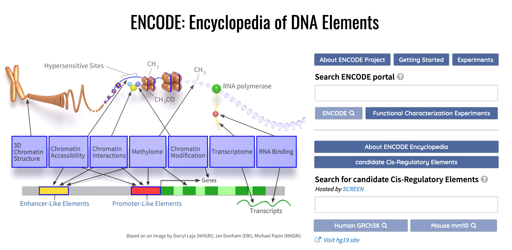
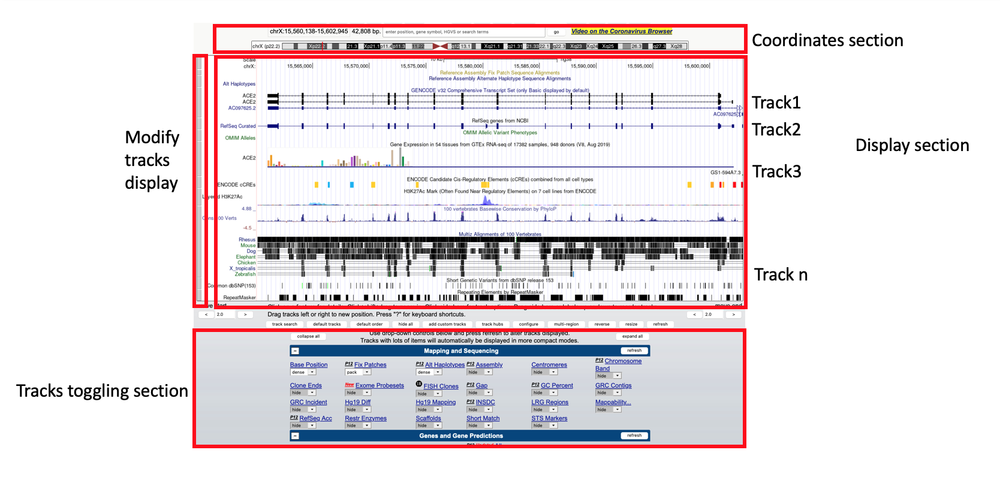

<div align="center">

    Advances in Research and Treatment of Hematological Malignancies (ARTHM)

Tutorial Developped by Pierre Khoueiry, Ph.D (Bioinformatics and Genomics)
   
</div>


**The Encyclopedia of DNA Elements (ENCODE)**

ENCODE is a public research consortium aimed at identifying all functional elements in the human and mouse genomes.

**Objectives:**
    In this tutorial, we will explore the ENCODE project database to search and 
    visualize genomics data generated by different labs, as part of the ENCODE project.
    In our tutorial, we will learn how to search, find and download data for a specific assay (i.e RNA-seq and ChIP-seq data on K562 cells).
    For RNA-seq, we will visualize expression profiles from 5 different hematopoietic cell lines (K562, GM12878).
    We will also add information from Pol II ChIP-seq performed on K562 and GM12878.

**Learning Outcomes**

* Search the ENCODE project for publicly available NGS related datasets
* Load and display NGS data on UCSC Genome browser
* Navigate and manipulate tracks on a Genome browser
* Visualize NGS data on UCSC Genome browser

## Interrogating and visualizing ENCODE data

Visit [https://www.encodeproject.org/](https://www.encodeproject.org/)



As you notice, several NGS based assays were used to interrogate several features in the genome. This includes expression assays, chromatin accessibility assays, Genome architecture assays and so on.
The home page gives us a general overview on available assays. 

```Select Human as model organism```

You notice that **12906** Biosamples exist as of March 2021. Since we will be focusing on cell-lines related data, we will select cell line

```Select Cell line from the Biosample Type list```

This will open a new page with a matrix summarizing, for each cell line, the different NGS related assays performed.

For instance, there are 635 different ChIP-seq experiment performed on K562 as part of the ENCODE project.

``` Click on 635 and you will get information on each of the 635 ChIP-seq including the Transcription Factor ChIPed ...```

We will now focus on total RNA-seq data. For this, we will use the left panel to narrow our search. 

In ```Assay type``` we will choose ```Transcription```

In ```Assay title``` we will choose ```total RNA-seq```

In ```Cell``` we will choose ```hematopoietic cell```

Our filtering will narrow down the results to only *4* cell lines: ```K562, GM12878, HL-60, Karpas-422, OCI-LY7```

Here, we will focus on ```K562``` and ```GM12878``` cell lines.

As you notice, there are  ```13 total RNA-seq``` that were performed on ```K562``` and ```5 on GM12878```

Let's explore the different options for ```K562``` from which we will choose the data performed in the lab of ```Barbara Wold, Caltech```

The page will show technical information related to the experiment, the biological replicates and additional information.

The ```Files``` section lists the different results associated with the experiment. You can download the files or visualize their content online.

The ```Association graph``` tab, explores how the analysis was performed and what type of output it gave.

The ```File details``` tab displays the files and allows you to download them or to visualize them using ```ENSEMBL``` or ```UCSC``` Genome browsers

In the ```File details``` section, ```Click on Visualize```. Make sure to choose ```UCSC``` as Genome Browser

## Visualizing ENCODE data on UCSC Genome browser

_"The UCSC Genome browser is a popular Web-based tool for quickly displaying a requested portion of a genome at any scale, accompanied by a series of aligned annotation tracks”_



We will explore the different options the Genome Browser offer to manipulate and visualize genomic data including ENCODE data


## Adding additional RNA-seq data from The Encyclopedia of DNA Elements (ENCODE)

Now that we explored how to search for available NGS assays for a specific cell line/tissue/organ, we will add new datasets to the Genome browser. For this

```Go back to ENCODE and load the total RNA-seq data for GM12878, another hematopoetic cell line, from the same lab (Barbara Wold, Caltech)```

As you can see, we now have a total RNA-seq track for each of K562 and GM12878. You can add as many track as you want.


## Integrating visualization for RNA-seq and ChIP-seq

We will now load several assays at the same time. As mentioned in the objectives above, we will also visualize ChIP-seq data for the transcription polymerase Pol2RA on both cell lines, K562 and GM12878

For this we will use the below filters on ENCODE:

In ```ENCODE home page``` choose ```Data Matrix```

In ```Assay type``` choose ```DNA binding```

In ```Assay title``` choose ```TF ChIP-seq```

In ```Perturbation``` choose ```not perturbed``` since we are interested in non treated samples so far

In ```Target of assay``` choose ```POLR2A```. NB: Here, you can decide on any TF you want

In ```Organism``` choose ```Homo sapiens```

In ```Biosample term name``` choose ```K562``` and ```GM12878```

This filtering strategy will yield to a matrix with 9 entries. Now, we can send the data for visualization on UCSC genome browser


